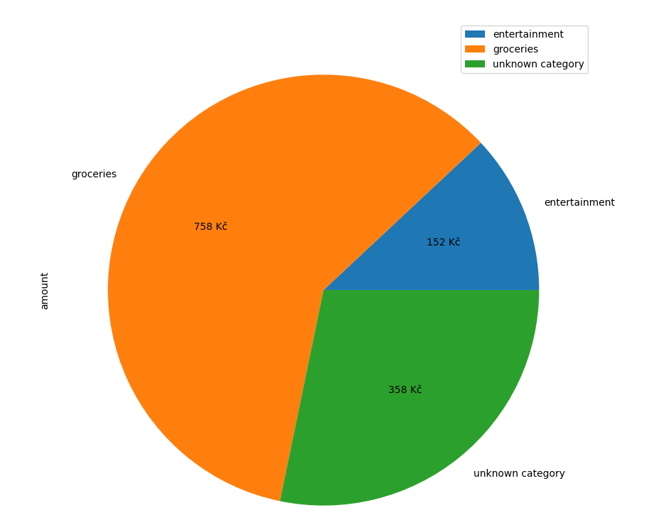

# KB Statement Analyzer

This is a simple script to parse KB's CSV statements 
and plot very basic pie chart of expenses.

Example:
```python3 run.py```



For the script to recognize more categories add them to ```categories.json```.